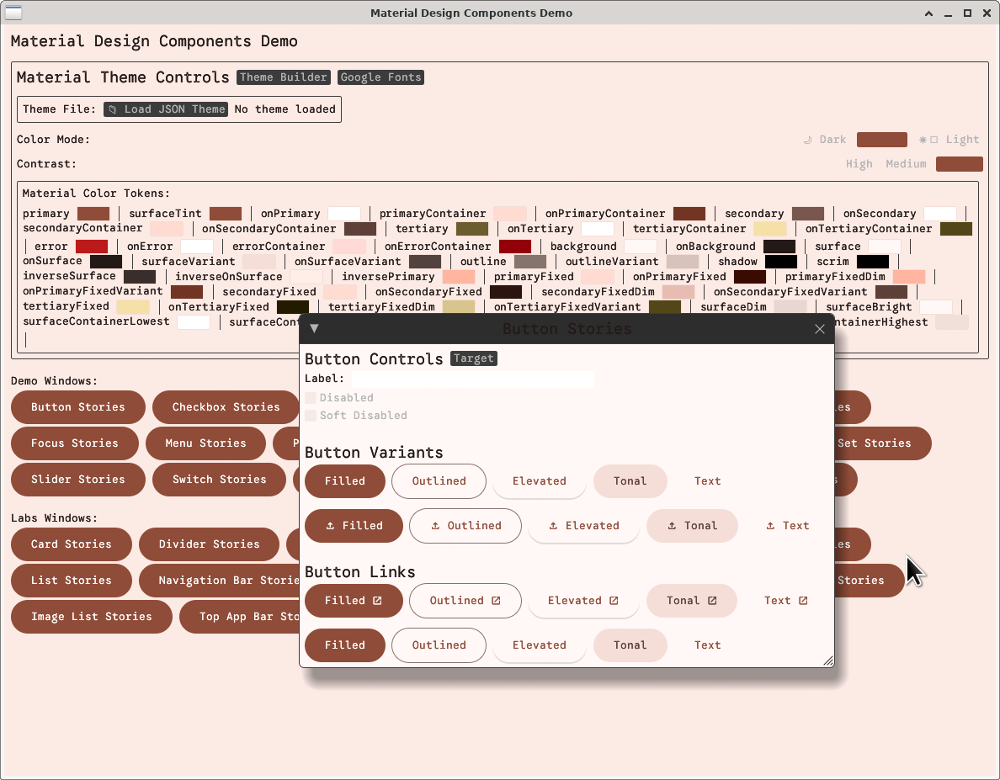

# egui-material3

A Material Design component library for egui, providing Material Design 3 components with theme support.

## Screenshots



## Usage

Add this to your `Cargo.toml`:

```bash
$ cargo add egui-material3
```

### Basic Example

```rust
use eframe::egui;
use egui_material3::{
    MaterialButton, MaterialCheckbox, MaterialSlider,
    theme::{setup_google_fonts, setup_local_fonts, setup_local_theme, load_fonts, load_themes, update_window_background}
};

fn main() -> Result<(), eframe::Error> {
    let options = eframe::NativeOptions {
        viewport: egui::ViewportBuilder::default().with_inner_size([800.0, 600.0]),
        ..Default::default()
    };
    
    eframe::run_native(
        "Material Design App",
        options,
        Box::new(|cc| {
            // Setup Material Design fonts and themes
            setup_google_fonts(Some("Roboto"));
            setup_local_fonts(Some("resources/MaterialSymbolsOutlined[FILL,GRAD,opsz,wght].ttf"));
            setup_local_theme(Some("resources/my-theme.json")); // or None for default
            
            // Load fonts and themes
            load_fonts(&cc.egui_ctx);
            load_themes();
            
            // Apply theme background
            update_window_background(&cc.egui_ctx);
            
            Ok(Box::<MyApp>::default())
        }),
    )
}

#[derive(Default)]
struct MyApp {
    text: String,
    checked: bool,
    slider_value: f32,
}

impl eframe::App for MyApp {
    fn update(&mut self, ctx: &egui::Context, _frame: &mut eframe::Frame) {
        egui::CentralPanel::default().show(ctx, |ui| {
            ui.heading("Material Design Components");
            
            // Material Design components
            ui.add(MaterialButton::new("Click me"));
            ui.add(MaterialCheckbox::new(&mut self.checked, "Check me"));
            ui.add(MaterialSlider::new(&mut self.slider_value, 0.0..=100.0).text("Slider"));
        });
    }
}
```

### Theme Support

The library supports Material Design 3 themes with:

- **Build-time theme inclusion**: Themes are automatically included from JSON files during compilation
- **Runtime theme loading**: Load custom themes from files at runtime  
- **Multiple theme modes**: Light, Dark, and Auto modes
- **Contrast levels**: Normal, Medium, and High contrast support
- **Dynamic updates**: Change themes and see updates immediately

### Available Components

- MaterialButton - Material Design buttons with multiple variants
- MaterialCheckbox - Checkboxes with Material Design styling
- MaterialSlider - Sliders following Material Design guidelines
- MaterialSwitch - Toggle switches
- MaterialRadio - Radio buttons
- MaterialSelect - Dropdown selects
- MaterialChip - Filter and action chips
- MaterialCard - Material Design cards
- MaterialDialog - Modal dialogs
- MaterialFab - Floating Action Buttons
- MaterialProgress - Progress indicators
- MaterialIcon - Material Design icons
- MaterialTabs - Tab navigation
- MaterialDrawer - Navigation drawers
- MaterialTopAppBar - App bars
- MaterialDataTable - Data tables with sorting and selection

## Examples

Look at the `examples/` folder for complete examples:

- `widget_gallery_example.rs` - Showcase of all Material components
- `nobel_prizes_example.rs` - Real-world data table example
