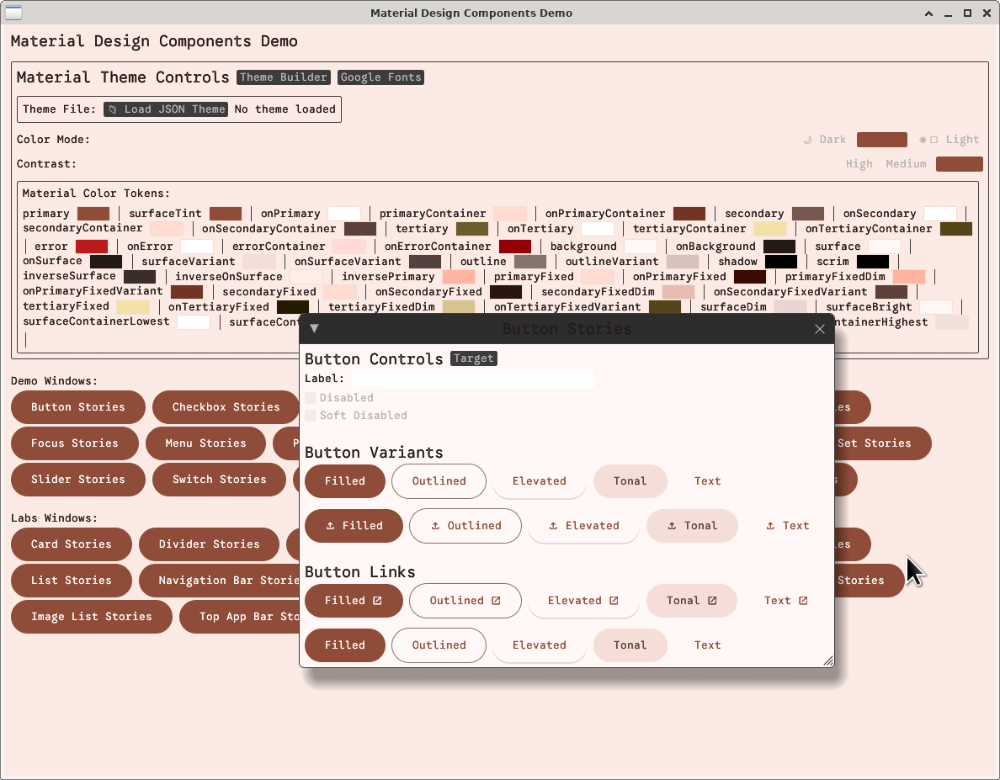

# egui-material3

A Material Design component library for egui, providing Material Design 3 components with theme support.

## Screenshots



## What's New

### v0.0.9 (Latest)
- **Optimized Package Size**: SVG icon collections are now optional features, reducing default package size significantly
  - Enable only the collections you need: `svg_solar`, `svg_noto`, `svg_twemoji`
  - Or enable all with `svg_emoji` feature
- **Build Optimization**: SVG resources excluded from default package, downloaded on-demand during build when features are enabled

### v0.0.8
- **New Components**: ActionSheet, Badge, Breadcrumbs, Notification, Timeline, Toolbar, Tooltip, TreeView
- **Enhanced Components**: Button, Chip, and List now support small size variants
- **Improved Carousel**: Added mouse drag support for better interaction
- **Better Mobile Support**: Optimized DataTable padding for mobile UI

### v0.0.7
- **Spreadsheet Component**: Full-featured spreadsheet with DuckDB backend
- **Image Carousel**: New MaterialCarousel component
- **Small Controls**: Added size variants for buttons, chips, and lists

### v0.0.6
- Initial release with core Material Design 3 components

## Installation

Add egui-material3 to your project:

```bash
# Basic installation
cargo add egui-material3

# With optional features
cargo add egui-material3 --features ondemand
cargo add egui-material3 --features "svg_solar,spreadsheet"
cargo add egui-material3 --features svg_emoji  # All icon collections
```

Or manually in `Cargo.toml`:

```toml
[dependencies]
egui-material3 = "0.0.9"

# With features
egui-material3 = { version = "0.0.9", features = ["ondemand", "svg_solar"] }
```

## Usage

### Quick Start Example

```rust
use eframe::egui;
use egui_material3::{
    MaterialButton, MaterialCheckbox, MaterialSlider, MaterialChip,
    MaterialBadge, MaterialSwitch, ButtonVariant,
    theme::{setup_google_fonts, setup_local_fonts, setup_local_theme,
           load_fonts, load_themes, update_window_background}
};

fn main() -> Result<(), eframe::Error> {
    let options = eframe::NativeOptions {
        viewport: egui::ViewportBuilder::default().with_inner_size([800.0, 600.0]),
        ..Default::default()
    };

    eframe::run_native(
        "Material Design App",
        options,
        Box::new(|cc| {
            // Setup Material Design fonts and themes
            setup_google_fonts(Some("Roboto"));
            setup_local_fonts(Some("resources/MaterialSymbolsOutlined.ttf"));
            setup_local_theme(None); // Use default theme

            // Load fonts and themes
            load_fonts(&cc.egui_ctx);
            load_themes();

            // Apply theme background
            update_window_background(&cc.egui_ctx);

            Ok(Box::<MyApp>::default())
        }),
    )
}

#[derive(Default)]
struct MyApp {
    checked: bool,
    switch_on: bool,
    slider_value: f32,
    chip_selected: bool,
}

impl eframe::App for MyApp {
    fn update(&mut self, ctx: &egui::Context, _frame: &mut eframe::Frame) {
        egui::CentralPanel::default().show(ctx, |ui| {
            ui.heading("Material Design Components");

            // Buttons with different variants
            ui.horizontal(|ui| {
                ui.add(MaterialButton::new("Filled").variant(ButtonVariant::Filled));
                ui.add(MaterialButton::new("Outlined").variant(ButtonVariant::Outlined));
                ui.add(MaterialButton::new("Text").variant(ButtonVariant::Text));
            });

            // Input controls
            ui.add(MaterialCheckbox::new(&mut self.checked, "Check me"));
            ui.add(MaterialSwitch::new(&mut self.switch_on, "Enable feature"));
            ui.add(MaterialSlider::new(&mut self.slider_value, 0.0..=100.0));

            // Chips and badges
            ui.horizontal(|ui| {
                ui.add(MaterialChip::new("Filter chip")
                    .selected(&mut self.chip_selected));
                ui.add(MaterialBadge::new().value(5).show(ui, |ui| {
                    ui.add(MaterialButton::new("Inbox"));
                }));
            });
        });
    }
}
```

### Advanced Example

Here's a more comprehensive example showcasing recent additions:

```rust
use egui_material3::{
    MaterialButton, MaterialBadge, MaterialToolbar, MaterialBreadcrumbs,
    MaterialNotification, MaterialTimeline, MaterialTooltip, MaterialTreeView,
    ButtonVariant, TimelineItem, TreeNode,
};

impl eframe::App for MyApp {
    fn update(&mut self, ctx: &egui::Context, _frame: &mut eframe::Frame) {
        egui::CentralPanel::default().show(ctx, |ui| {
            // Toolbar with actions
            ui.add(MaterialToolbar::new()
                .title("My Application")
                .add_action("search", || println!("Search"))
                .add_action("settings", || println!("Settings")));

            // Breadcrumb navigation
            ui.add(MaterialBreadcrumbs::new()
                .add_item("Home", || println!("Home"))
                .add_item("Projects", || println!("Projects"))
                .add_current("Current Project"));

            // Badge example
            ui.horizontal(|ui| {
                ui.add(MaterialBadge::new().value(3).show(ui, |ui| {
                    ui.add(MaterialButton::new("Messages"));
                }));

                // Tooltip example
                MaterialTooltip::new("Click to refresh").show(ui, |ui| {
                    ui.add(MaterialButton::new("Refresh")
                        .variant(ButtonVariant::Outlined));
                });
            });

            // Notification
            ui.add(MaterialNotification::new("Update available")
                .description("Version 2.0 is ready to install")
                .add_action("Update", || println!("Updating..."))
                .closable(true));

            // Timeline
            let events = vec![
                TimelineItem::new("Project created").with_timestamp("2024-01-01"),
                TimelineItem::new("First commit").with_timestamp("2024-01-02"),
                TimelineItem::new("Version 1.0 released").with_timestamp("2024-02-01"),
            ];
            ui.add(MaterialTimeline::new(events));

            // TreeView for hierarchical data
            let tree = vec![
                TreeNode::new("Root")
                    .add_child(TreeNode::new("Child 1"))
                    .add_child(TreeNode::new("Child 2")
                        .add_child(TreeNode::new("Grandchild"))),
            ];
            ui.add(MaterialTreeView::new(tree));
        });
    }
}
```

## Theme System

The library provides comprehensive Material Design 3 theming capabilities:

### Build-time Theme Inclusion

Themes are automatically included from JSON files during compilation:

```rust
use egui_material3::theme::{setup_local_theme, load_themes};

// Uses themes from resources/ and examples/ directories automatically
setup_local_theme(None);
load_themes();
```

### Runtime Theme Loading

Load custom themes dynamically:

```rust
use egui_material3::theme::{setup_local_theme, load_themes};

// Load specific theme file
setup_local_theme(Some("path/to/my-theme.json"));
load_themes();
```

### Theme Modes and Contrast Levels

Dynamically change theme appearance at runtime:

```rust
use egui_material3::theme::{get_global_theme, update_window_background, ThemeMode, ContrastLevel};

// Switch between light and dark modes
if let Ok(mut theme) = get_global_theme().lock() {
    theme.theme_mode = ThemeMode::Dark; // or ThemeMode::Light
    theme.contrast_level = ContrastLevel::High; // Standard, Medium, or High
}
update_window_background(ctx);

// Or toggle mode with a button
if ui.add(MaterialButton::new("Toggle Dark Mode")).clicked() {
    if let Ok(mut theme) = get_global_theme().lock() {
        theme.theme_mode = match theme.theme_mode {
            ThemeMode::Light => ThemeMode::Dark,
            ThemeMode::Dark => ThemeMode::Light,
        };
    }
    update_window_background(ctx);
}
```

### Component Size Variants

Many components support size variants for different design needs:

```rust
use egui_material3::{MaterialButton, MaterialChip, ButtonSize, ChipSize};

// Small button for compact UIs
ui.add(MaterialButton::new("Compact").size(ButtonSize::Small));

// Standard size (default)
ui.add(MaterialButton::new("Standard"));

// Small chips for tags
ui.add(MaterialChip::new("Tag").size(ChipSize::Small));
```

## Available Components

### Input & Selection

- **MaterialButton** - Material Design buttons with multiple variants (filled, outlined, text, elevated, tonal) and size options
- **MaterialIconButton** - Icon buttons (standard, filled, filled tonal, outlined, toggle)
- **MaterialCheckbox** - Checkboxes following Material Design guidelines
- **MaterialSwitch** - Toggle switches
- **MaterialRadio** / **MaterialRadioGroup** - Radio button groups with list tile support
- **MaterialSlider** / **MaterialRangeSlider** - Sliders with Material Design styling
- **MaterialSelect** - Dropdown selection components with menu alignment options
- **MaterialChip** - Filter, assist, input, and suggestion chips with size variants

### Navigation & Layout

- **MaterialTabs** - Tab navigation (primary and secondary variants)
- **MaterialDrawer** - Navigation drawers (permanent, dismissible, modal, standard)
- **MaterialTopAppBar** - App bars and toolbars (standard, center-aligned, medium, large)
- **MaterialToolbar** - Flexible toolbar component with action items
- **MaterialBreadcrumbs** - Breadcrumb navigation for hierarchical paths
- **MaterialMenu** - Context menus and menu items with nested support

### Feedback & Information

- **MaterialDialog** - Modal dialogs and alerts
- **MaterialSnackbar** - Toast notifications with optional actions
- **MaterialNotification** - Notification cards with actions and dismissal
- **MaterialBadge** - Badge indicators for counts and status
- **MaterialProgress** - Progress indicators (circular and linear)
- **MaterialTooltip** - Contextual tooltips with rich text support
- **MaterialActionSheet** - Bottom sheets for action selection

### Data Display

- **MaterialCard2** - Material Design cards (elevated, filled, outlined variants)
- **MaterialList** - Lists following Material Design patterns with visual density control
- **MaterialDataTable** - Data tables with sorting, selection, and custom cell content
- **MaterialSpreadsheet** - Full-featured spreadsheet with DuckDB backend (requires `spreadsheet` feature)
- **MaterialTimeline** - Timeline component for chronological data
- **MaterialTreeView** - Hierarchical tree view with expand/collapse

### Media & Content

- **MaterialCarousel** - Carousel for displaying items in a scrollable view with mouse drag support
- **MaterialImageList** - Image lists with online/offline support and smart caching (standard, masonry, woven variants)
- **MaterialLayoutGrid** - Grid layout with tile bars
- **MaterialFab** - Floating Action Buttons (primary, secondary, tertiary, surface, branded)

### Icons & Symbols

- **MaterialIcon** - Material Design icons with font support
- **MaterialSymbol** - Material Symbols rendering (outlined, rounded, sharp variants)

## Common Patterns

### Building a Complete UI

Combine components to create rich user interfaces:

```rust
use egui_material3::*;

impl eframe::App for MyApp {
    fn update(&mut self, ctx: &egui::Context, _frame: &mut eframe::Frame) {
        // Top app bar
        egui::TopBottomPanel::top("top_bar").show(ctx, |ui| {
            ui.add(MaterialTopAppBar::new()
                .title("My App")
                .add_action("notifications", |ui| {
                    // Badge on icon button
                    MaterialBadge::new().value(5).show(ui, |ui| {
                        ui.add(MaterialIconButton::new("notifications"));
                    });
                }));
        });

        // Navigation drawer
        egui::SidePanel::left("drawer").show(ctx, |ui| {
            ui.add(MaterialDrawer::new()
                .add_item("Home", "home", || println!("Home"))
                .add_item("Settings", "settings", || println!("Settings")));
        });

        // Main content
        egui::CentralPanel::default().show(ctx, |ui| {
            // Action buttons with tooltips
            ui.horizontal(|ui| {
                MaterialTooltip::new("Create new item").show(ui, |ui| {
                    if ui.add(MaterialButton::new("New")
                        .variant(ButtonVariant::Filled)).clicked() {
                        // Show action sheet
                        self.show_action_sheet = true;
                    }
                });
            });

            // Data display with cards
            ui.add(MaterialCard2::elevated()
                .show(ui, |ui| {
                    ui.heading("Recent Activity");
                    ui.add(MaterialTimeline::new(self.recent_events.clone()));
                }));

            // Notifications
            if self.has_updates {
                ui.add(MaterialNotification::new("Update available")
                    .add_action("Install", || self.install_update())
                    .closable(true));
            }
        });

        // Bottom action sheet
        if self.show_action_sheet {
            ui.add(MaterialActionSheet::new()
                .add_action("Create Document", || println!("Document"))
                .add_action("Create Folder", || println!("Folder"))
                .on_dismiss(|| self.show_action_sheet = false));
        }

        // FAB (Floating Action Button)
        egui::Area::new("fab")
            .anchor(egui::Align2::RIGHT_BOTTOM, egui::vec2(-16.0, -16.0))
            .show(ctx, |ui| {
                if ui.add(MaterialFab::primary().icon("add")).clicked() {
                    println!("FAB clicked");
                }
            });
    }
}
```

### Form with Validation

Create forms with Material components:

```rust
ui.vertical(|ui| {
    ui.label("User Information");

    // Text inputs with validation
    ui.add(MaterialTextField::new(&mut self.name)
        .label("Full Name")
        .required(true));

    // Selection controls
    ui.add(MaterialSelect::new(&mut self.country)
        .label("Country")
        .options(vec!["USA", "UK", "Canada"]));

    // Checkboxes for preferences
    ui.add(MaterialCheckbox::new(&mut self.newsletter,
        "Subscribe to newsletter"));

    ui.add(MaterialCheckbox::new(&mut self.terms,
        "I agree to the terms"));

    // Action buttons
    ui.horizontal(|ui| {
        if ui.add(MaterialButton::new("Submit")
            .variant(ButtonVariant::Filled)
            .enabled(self.terms)).clicked() {
            self.submit_form();
        }

        ui.add(MaterialButton::new("Cancel")
            .variant(ButtonVariant::Text));
    });
});
```

## Optional Icon & Emoji Collections

The library provides three comprehensive SVG collections as optional features. Each can be enabled independently:

- **Solar Icons** (`svg_solar`) - ~1,200 UI/UX icons with variants
- **Noto Emoji** (`svg_noto`) - ~3,600 Google emojis with skin tone and gender variants
- **Twemoji** (`svg_twemoji`) - ~3,700 Twitter emoji

### Feature Configuration

Choose the collections you need:

```toml
[dependencies]
# Enable individual collections (recommended - smaller binary size)
egui-material3 = { version = "0.0.9", features = ["svg_solar"] }

# Or enable specific combinations
egui-material3 = { version = "0.0.9", features = ["svg_solar", "svg_noto"] }

# Or enable all collections
egui-material3 = { version = "0.0.9", features = ["svg_emoji"] }
```

### Usage

Icons and emojis are accessible through HashMaps with O(1) lookup:

```rust
use egui_material3::svg_emoji::{SOLAR_ICONS, NOTO_EMOJIS, TWEMOJI};

// Access Solar icons (requires svg_solar feature)
if let Some(svg) = SOLAR_ICONS.get("home") {
    // Use SVG data for rendering
}

// Access Noto emoji (requires svg_noto feature)
// Filename format: "emoji_u" + unicode codepoint
if let Some(svg) = NOTO_EMOJIS.get("emoji_u1f600") {
    // 😀 Grinning face emoji
}

// Access Twemoji (requires svg_twemoji feature)
// Filename format: unicode codepoint
if let Some(svg) = TWEMOJI.get("1f600") {
    // 😀 Grinning face emoji
}
```

**Note**: SVG files are embedded at compile time when features are enabled. If building from crates.io (not git), files are automatically downloaded during build.

## Features

### OnDemand Feature

Enable online image support for `MaterialImageList`:

```toml
[dependencies]
egui-material3 = { version = "0.0.9", features = ["ondemand"] }
```

The `MaterialImageList` component supports multiple image sources:

```rust
use egui_material3::image_list;

// Local image files
ui.add(image_list()
    .columns(3)
    .item_spacing(8.0)
    .items_from_paths(glob::glob("resources/*.png")?));

// Online images (requires 'ondemand' feature)
ui.add(image_list()
    .columns(4)
    .item_spacing(8.0)
    .items_from_urls(vec![
        "https://example.com/image1.jpg".to_string(),
        "https://example.com/image2.png".to_string(),
    ]));

// Embedded images from byte arrays
ui.add(image_list()
    .columns(2)
    .item_spacing(8.0)
    .items_from_bytes(vec![
        include_bytes!("image1.png").to_vec(),
        include_bytes!("image2.png").to_vec(),
    ]));
```

Key capabilities:
- **Smart caching**: Downloaded images cached locally with correct file extensions
- **Format detection**: Automatically detects PNG, JPEG, GIF, and WebP formats
- **Efficient loading**: Images downloaded once and reused from cache
- **Performance optimized**: UI repaints only when new images available
- **Error handling**: Graceful fallback with visual indicators for failed loads

### Spreadsheet Feature

Enable spreadsheet components with DuckDB backend:

```toml
[dependencies]
egui-material3 = { version = "0.0.9", features = ["spreadsheet"] }
```

The spreadsheet feature provides:

- **MaterialSpreadsheet** - Full-featured spreadsheet widget with DuckDB backend
- **Column types**: Text, Integer, Real, Boolean
- **File formats**: Import/export CSV, Excel (xls/xlsx), Parquet formats
- **Async loading**: Background data loading with progress indicators
- **Data manipulation**: Full SQL query support via DuckDB

```rust
use egui_material3::{MaterialSpreadsheet, SpreadsheetDataModel, ColumnDef, ColumnType};

// Create spreadsheet with column definitions
let columns = vec![
    ColumnDef { name: "Name".to_string(), col_type: ColumnType::Text, width: 150.0 },
    ColumnDef { name: "Age".to_string(), col_type: ColumnType::Integer, width: 80.0 },
    ColumnDef { name: "Score".to_string(), col_type: ColumnType::Real, width: 100.0 },
];

let mut model = SpreadsheetDataModel::new("my_table", columns)?;

// Import data from CSV/Excel/Parquet
model.import_file("data.csv", FileFormat::Csv)?;

// Display in UI
ui.add(MaterialSpreadsheet::new(&mut model));
```

## Examples

The crate includes comprehensive examples demonstrating all components:

```bash
# Complete showcase of all Material components with theme switching
cargo run --example widget_gallery_example

# Real-world data table implementation with Nobel Prize data
cargo run --example nobel_prizes_example

# Interactive component gallery (recommended for exploration)
cargo run --example stories

# SVG icon demonstration (requires svg_solar feature)
cargo run --example svg_icon_demo --features svg_solar
```

### Stories Example - Component Explorer

The `stories` example provides an interactive gallery with individual showcases for each component:

**Input & Selection**: actionsheet, button, checkbox, chips, iconbutton, radio, select, slider, switch
**Navigation**: breadcrumbs, drawer, menu, tabs, toolbar, topappbar, treeview
**Feedback**: badge, dialog, notification, progress, snackbar, tooltip
**Data Display**: card2, datatable, list, spreadsheet, timeline
**Media**: carousel, imagelist, layoutgrid, svgemoji, symbol

Each story window demonstrates component variants, states, and common usage patterns.

### Standalone Examples

```bash
# OnDemand example - demonstrates online image loading
cd examples/ondemand && cargo run

# Package example - standalone deployable app with bundled resources
cd examples/package && cargo run
```

### Running with Features

```bash
# Run with spreadsheet support
cargo run --example stories --features spreadsheet

# Run with all SVG icon collections
cargo run --example stories --features svg_emoji

# Run with specific features
cargo run --example stories --features "ondemand,svg_solar"
```

## Documentation

- [API Documentation](https://docs.rs/egui-material3)
- [Material Design 3 Guidelines](https://m3.material.io/)
- [Examples](./examples/)

## Contributing

Contributions are welcome! Please check the [issues](https://github.com/nikescar/egui-material3/issues) for open tasks or create a new one.

## License

Licensed under either of:

- Apache License, Version 2.0 ([LICENSE-Apache-2.0](LICENSE-Apache-2.0) or http://www.apache.org/licenses/LICENSE-2.0)
- MIT license ([LICENSE-MIT](LICENSE-MIT) or http://opensource.org/licenses/MIT)

at your option.

---

<details markdown>
<summary>Development Notes</summary>

## Todos

* SVG sprite support
* Bump egui_extras to match resvg version (currently using patched 0.47)
* Additional component variants
* Performance optimizations for large datasets

</details>
